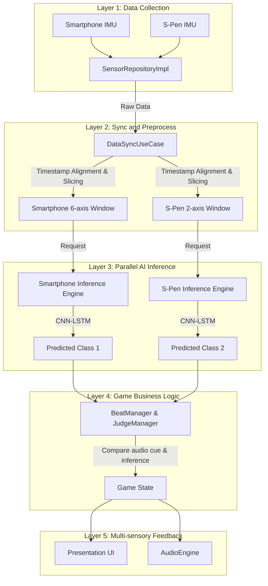
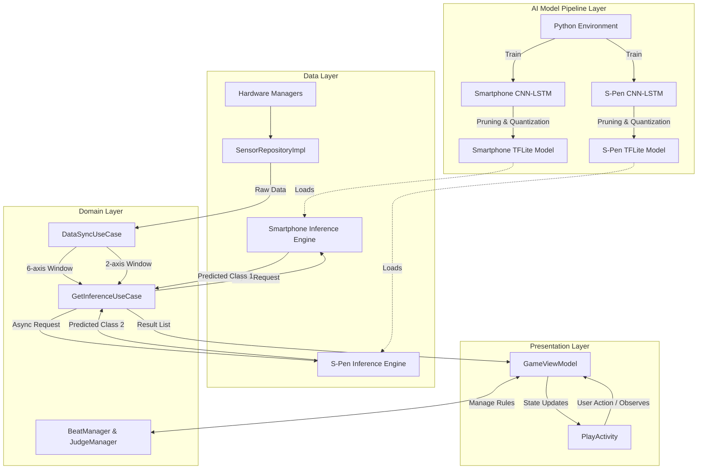

# 02_System_Architecture

### Version History

| Date | Version | Remarks |
| --- | --- | --- |
| 2026-05-14 | 1.0 | Initial release |
| 2026-05-18 | 1.1 | Updated pipeline and MVVM plus AI architecture based on detailed specification |
| 2026-05-18 | 1.2 | Updated pipeline for 8-axis sensor fusion and removed spatial audio |
| 2026-05-30 | 1.3 | Updated to parallel dual-model architecture for independent smartphone and S-Pen inference |

---

### 1. Technology Stack

1.1. Frontend and UI Environment
* Language: Kotlin (Android Native)
* IDE: Android Studio
* Pattern: MVVM (Model-View-ViewModel)

1.2. Machine Learning and Optimization
* Training: Python, PyTorch (Google Colab)
* Optimization: PyTorch Pruning API (Channel Pruning)
* Inference: TensorFlow Lite (INT8 Linear Quantization)

1.3. Hardware Sensor Communication
* Smartphone: Android SensorManager API (Linear Acceleration, Gyroscope)
* S-Pen: Samsung S-Pen Remote SDK (BLE)

1.4. Media and Feedback Processing
* Audio Engine: Google Oboe (Low-latency stereo audio)
* Haptic: Android Vibrator API

---

### 2. Five-Layer Data Pipeline

The system processes data through a structured 5-layer pipeline to ensure real-time performance, utilizing two independent AI models to allow simultaneous drum strikes.

Layer 1 (Data Collection): The data layer utilizes SPenManager and PhoneSensorManager via SensorRepositoryImpl to stream raw data from two heterogeneous devices.

Layer 2 (Sync and Preprocess): The domain layer utilizes DataSyncUseCase to align timestamps and create separated 200ms overlapping windows for smartphone 6-axis data and S-Pen 2-axis data.

Layer 3 (Parallel AI Inference): The domain layer uses GetInferenceUseCase to call parallel InferenceEngineImpl instances in the data layer. Each engine independently classifies the motion to support simultaneous strikes without fusion.

Layer 4 (Game Business Logic): The domain layer manages the game rules through BeatManager and JudgeManager, evaluating independent predictions to handle dual-hand simultaneous drumming combinations.

Layer 5 (Multi-sensory Feedback): The presentation layer and AudioEngine deliver immediate multi-channel mixing responses, including screen color changes, haptic vibrations, and low-latency audio for multiple instruments.

--------------------------------------------------------------------------------

3. Software Architecture (MVVM plus AI)
The application follows an extended 4-layer architecture separating the offline dual AI pipeline from the runtime MVVM structure.

3.1. AI Model Pipeline Layer An offline prerequisite layer operating in a Python environment. It handles raw data preprocessing, dual CNN-LSTM model training, channel pruning, and INT8 linear quantization to export two separated TensorFlow Lite models for smartphone and S-Pen.

3.2. Data Layer (Model) Responsible for direct hardware communication and low-level API handling. It contains the SensorRepositoryImpl, hardware managers, and dual InferenceEngineImpl instances which load each specific TFLite model. This layer acts as the Model in MVVM, providing refined data and parallel AI predictions to the ViewModel.

3.3. Domain Layer Contains the pure business logic and synchronization pipeline. It houses DataSyncUseCase, GetInferenceUseCase, BeatManager, and JudgeManager. It receives independent predictions from both models simultaneously and returns a list of results to handle cross-hand drumming.

3.4. Presentation Layer (View and ViewModel) Handles user interaction, state management, and real-time sensory feedback execution. Divided into main, game, and logger packages. The GameViewModel communicates with the Model (Data and Domain layers) to request parallel AI predictions and updates the PlayActivity view based on the returned instrument classes and game states.
