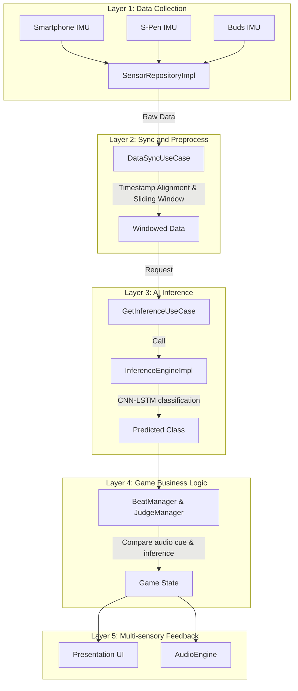
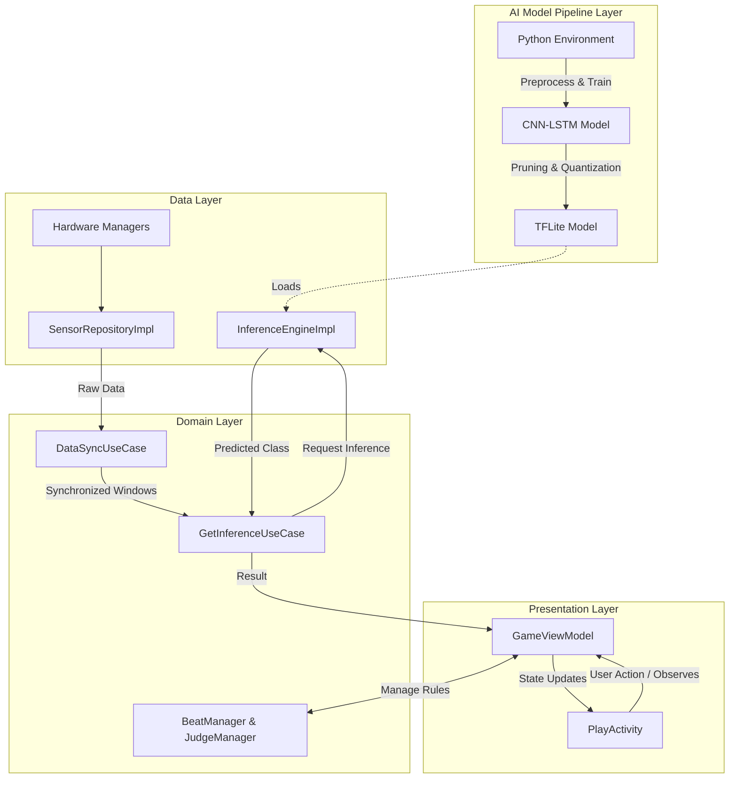

# point6 System Architecture Specification

### Version History

| Date | Version | Remarks |
| :--- | :--- | :--- |
| 2026-05-14 | 1.0 | Initial release |
| 2026-05-18 | 1.1 | Updated pipeline and MVVM plus AI architecture based on detailed specification |

---

### 1. Technology Stack

1.1. Frontend and UI Environment

Language: Kotlin (Android Native)

IDE: Android Studio

Pattern: MVVM (Model-View-ViewModel)

1.2. Machine Learning and Optimization

Training: Python, PyTorch (Google Colab)

Optimization: PyTorch Pruning API (Channel Pruning)

Inference: TensorFlow Lite (INT8 Linear Quantization)

1.3. Hardware Sensor Communication

Smartphone: Android SensorManager API (Linear Acceleration, Gyroscope)

S-Pen: Samsung S-Pen Remote SDK (BLE)

Galaxy Buds: Android Bluetooth and Sensor API (Head Tracking)

1.4. Media and Feedback Processing

Audio Engine: Google Oboe

Haptic: Android Vibrator API

---

### 2. Five-Layer Data Pipeline

The system processes data through a structured 5-layer pipeline to ensure real-time performance and accuracy.

Layer 1 (Data Collection): The data layer utilizes SpenManager, BudsManager, and SensorRepositoryImpl to stream 18-axis raw data from three heterogeneous devices.

Layer 2 (Sync and Preprocess): The domain layer utilizes DataSyncUseCase to align timestamps and create 200ms overlapping windows from the multi-frequency sensor data.

Layer 3 (AI Inference): The domain layer uses GetInferenceUseCase to call InferenceEngineImpl in the data layer, which classifies the 7 instrument motions in real-time.

Layer 4 (Game Business Logic): The domain layer manages the game rules through BeatManager and JudgeManager, comparing audio cue beats with the user strike inference results.

Layer 5 (Multi-sensory Feedback): The presentation layer and AudioEngine deliver immediate multi-sensory responses, including screen color changes, haptic vibrations, and 3D spatial audio.

---

### 3. Software Architecture (MVVM plus AI)

The application follows an extended 4-layer architecture separating the offline AI pipeline from the runtime MVVM structure.

3.1. AI Model Pipeline Layer
An offline prerequisite layer operating in a Python environment. It handles raw data preprocessing, CNN-LSTM hybrid model training, channel pruning, and INT8 linear quantization to export the final TensorFlow Lite model.

3.2. Data Layer (Model)
Responsible for direct hardware communication and low-level API handling. It contains the SensorRepositoryImpl, hardware managers, and the InferenceEngineImpl which loads the TFLite model. This layer acts as the Model in MVVM, providing refined data and AI predictions to the ViewModel.

3.3. Domain Layer
Contains the pure business logic and synchronization pipeline. It houses DataSyncUseCase, GetInferenceUseCase, BeatManager, and JudgeManager, serving as the bridge between raw data processing and UI state generation.

3.4. Presentation Layer (View and ViewModel)
Handles user interaction, state management, and real-time sensory feedback execution. Divided into main, game, and logger packages. The GameViewModel communicates with the Model (Data and Domain layers) to request AI predictions and updates the PlayActivity view based on the returned instrument classes and game states.
