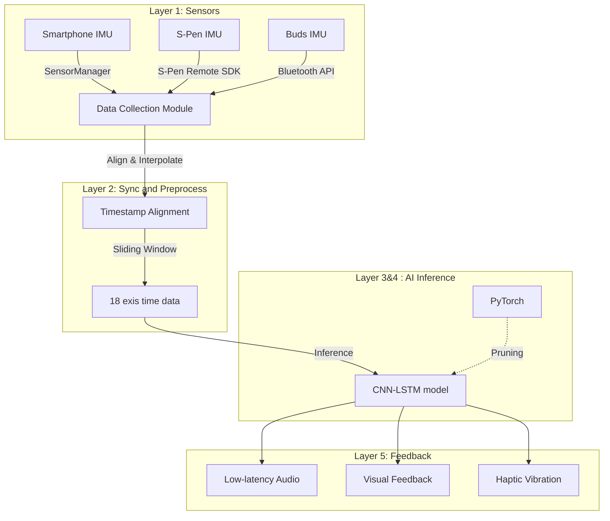
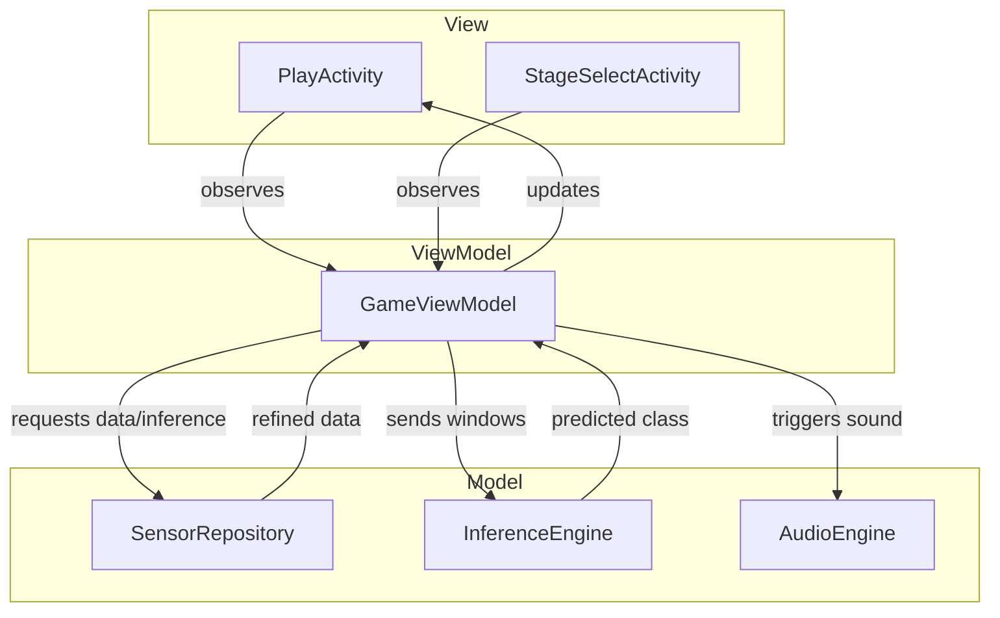

# point6 System Architecture Specification

### Version History

| Date | Version | Remarks |
| :--- | :--- | :--- |
| 2026-05-14 | v1.0 | Initial release |

---

### 1. Technology Stack

1.1. Frontend and UI Environment

Language: Kotlin (Android Native)

IDE: Android Studio

Pattern: MVVM (Model-View-ViewModel)

1.2. Machine Learning and Optimization

Training: Python, PyTorch (Google Colab)

Optimization: PyTorch Pruning API (Channel Pruning)

Inference: TensorFlow Lite (INT8 Linear Quantization)

1.3. Hardware Sensor Communication

Smartphone: Android SensorManager API (Linear Acceleration, Gyroscope)

S-Pen: Samsung S-Pen Remote SDK (BLE)

Galaxy Buds: Android Bluetooth and Sensor API (Head Tracking)

1.4. Media and Feedback Processing

Audio Engine: Google Oboe

Haptic: Android Vibrator API

---

### 2. Five-Layer Data Pipeline

The system processes data through a structured 5-layer pipeline to ensure real-time performance and accuracy.

Layer 1 (Sensors): Synchronous acquisition of 18-axis data from three heterogeneous devices.

Layer 2 (Sync and Preprocess): Aligning different sampling frequencies and creating 200ms overlapping windows.

Layer 3 (Inference): Real-time classification of the 7 instrument motions using the optimized CNN-LSTM model.

Layer 4 (Pruning and Quantization): Optimizing the model

Layer 5 (Feedback): Delivering multi-sensory responses within 50ms total latency.

---

### 3. Software Architecture (MVVM)

The application follows the MVVM pattern to decouple data handling from the user interface.

3.1. Model
SensorRepository: Handles raw sensor data and implements Layer 2 logic for windowing.
InferenceEngine: Manages the TFLite interpreter and returns predicted drum classes.
AudioEngine: A JNI wrapper for Oboe C++ to play spatialized drum sounds.

3.2. ViewModel
GameViewModel: Manages the business logic, score calculation, and current/next pattern states.

3.3. View
PlayActivity: Renders the real-time sensor graphs and handles full-screen color feedback based on performance.
StageSelectActivity: Provides the navigation interface for selecting BGM and difficulty.
